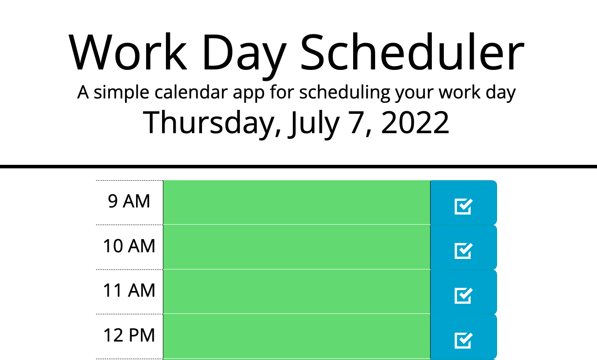

# Work Day Scheduler Starter Code

## Description

A simple daily scheduler to plan workday appointments and tasks. Input is stored in local storage. Time blocks are coded for easy reference to show whether they are past, current, or future events.

## Issues

- Difficulty getting the dates to sort to past present and future. Used Luxon instead of moment.js because of obsolescence issues. Needed to create 24 hr clock class in order to create a working comparable in the loop.

## Screenshot

## Contact

Christina DuWors 
christinaduwors@gmail.com 
github.com/cduwors

GitHub Repository: https://github.com/cduwors/work-day-scheduler

Deployed application: https://cduwors.github.io/work-day-scheduler/
